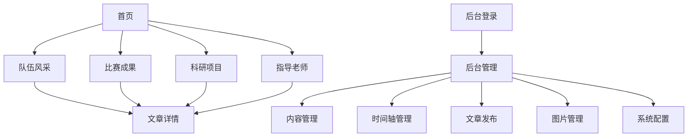

## 1. 产品概述
团队风采展示网站是一个专为团队展示而设计的综合性平台，用于展示队伍风采、比赛成果、科研项目和指导老师信息。网站支持文章发布功能，采用Markdown语法，并提供完善的后台管理系统。

该网站帮助团队建立专业形象，展示团队实力，吸引更多关注和合作机会。

## 2. 核心功能

### 2.1 用户角色
| 角色 | 注册方式 | 核心权限 |
|------|----------|----------|
| 访客用户 | 无需注册 | 浏览所有公开页面内容 |
| 管理员 | 后台创建账号 | 管理所有内容、发布文章、上传图片、配置系统设置 |

### 2.2 功能模块
网站包含以下主要页面：
1. **首页**：团队介绍、轮播图、导航菜单、最新动态展示
2. **队伍风采页**：团队成员展示、团队文化、发展历程（支持时间轴展示）
3. **比赛成果页**：比赛列表、获奖展示、比赛详情
4. **科研项目页**：项目列表、项目详情、研究成果展示
5. **指导老师页**：导师介绍、导师风采、联系方式
6. **文章详情页**：文章内容展示、Markdown渲染、相关推荐
7. **后台管理页**：内容管理、文章编辑、图片管理、系统配置

### 2.3 页面详情
| 页面名称 | 模块名称 | 功能描述 |
|----------|----------|----------|
| 首页 | 轮播图模块 | 展示团队精彩瞬间，支持自动轮播和手动切换 |
| 首页 | 团队介绍 | 展示团队基本信息、核心理念和发展目标 |
| 首页 | 导航菜单 | 提供快速访问各个功能页面的入口 |
| 首页 | 最新动态 | 展示最新发布的文章和重要通知 |
| 队伍风采页 | 成员展示 | 展示团队成员照片、姓名、职位和简介 |
| 队伍风采页 | 团队文化 | 展示团队价值观、使命愿景等文化内容 |
| 队伍风采页 | 发展历程 | 时间轴形式展示团队发展的重要节点 |
| 比赛成果页 | 比赛列表 | 展示参与的比赛项目，支持分类筛选 |
| 比赛成果页 | 获奖展示 | 突出展示获得的奖项和荣誉 |
| 比赛成果页 | 详情查看 | 查看具体比赛的详细介绍和成果 |
| 科研项目页 | 项目列表 | 展示所有科研项目，支持关键词搜索 |
| 科研项目页 | 项目详情 | 展示项目背景、目标、进展和成果 |
| 指导老师页 | 导师列表 | 展示所有指导老师的基本信息 |
| 指导老师页 | 导师详情 | 详细介绍导师的背景、研究方向和成就 |
| 文章详情页 | 内容展示 | 渲染Markdown格式的文章内容 |
| 文章详情页 | 相关推荐 | 推荐相关的其他文章 |
| 后台管理页 | 登录模块 | 管理员账号登录验证 |
| 后台管理页 | 内容管理 | 管理首页内容、团队信息等基础内容 |
| 后台管理页 | 文章编辑 | 使用Markdown编辑器创建和编辑文章 |
| 后台管理页 | 时间轴管理 | 管理团队发展历程的时间节点事件 |
| 后台管理页 | 图片管理 | 上传、删除和管理图片资源 |
| 后台管理页 | 系统配置 | 配置对象存储、网站基本信息等 |

## 3. 核心流程

### 访客用户流程
访客用户可以直接访问网站首页，通过导航菜单浏览队伍风采、比赛成果、科研项目和指导老师等页面。在文章详情页可以阅读详细内容，系统会自动推荐相关文章。

### 管理员流程
管理员需要通过后台登录页面进行身份验证，登录后可以进入管理后台。在后台可以发布新文章（支持Markdown语法），管理现有内容，上传图片到对象存储，以及配置系统参数。

## 4. 用户界面设计

### 4.1 设计风格
- **主色调**：深蓝色 (#1e3a8a) 搭配白色背景，体现专业和科技感
- **辅助色**：浅灰色 (#f3f4f6) 用于背景，橙色 (#f97316) 用于强调和按钮
- **按钮样式**：圆角矩形设计，hover效果使用阴影和颜色渐变
- **字体**：中文使用思源黑体，英文使用Roboto，正文字号16px，标题逐级递增
- **布局风格**：卡片式布局，顶部导航栏固定，内容区域自适应宽度
- **图标风格**：使用线性图标，简洁现代，与整体设计风格保持一致

### 4.2 页面设计概览
| 页面名称 | 模块名称 | UI元素 |
|----------|----------|--------|
| 首页 | 轮播图 | 全宽设计，高度400px，支持淡入淡出切换效果，底部有指示器 |
| 首页 | 团队介绍 | 居中布局，白色卡片背景，阴影效果，包含团队logo和简介文字 |
| 队伍风采页 | 成员展示 | 网格布局，每行4个成员卡片，卡片包含圆形头像和简介 |
| 比赛成果页 | 比赛列表 | 时间轴形式展示，左侧图片右侧文字，交替排列增强视觉效果 |
| 科研项目页 | 项目卡片 | 卡片式网格布局，悬停时有上浮动画，显示项目封面和标题 |
| 文章详情页 | 内容区域 | 白色背景，最大宽度800px，Markdown渲染后的内容有良好的排版 |
| 后台管理页 | 编辑界面 | 左侧菜单栏固定，右侧内容区域，使用富文本编辑器支持Markdown |

### 4.3 响应式设计
采用桌面端优先的设计理念，确保在1920x1080分辨率下有最佳展示效果。同时适配平板（768px-1024px）和手机（<768px）设备：
- 导航栏在移动端转换为汉堡菜单
- 网格布局在不同屏幕尺寸下自动调整列数
- 文字大小和间距会适当调整以保证可读性
- 触摸交互优化，按钮和链接有合适的点击区域

### 4.4 图片存储说明
所有图片资源统一上传到对象存储服务，后端提供上传接口和管理功能。支持图片压缩、格式转换和CDN加速，确保网站加载速度和用户体验。