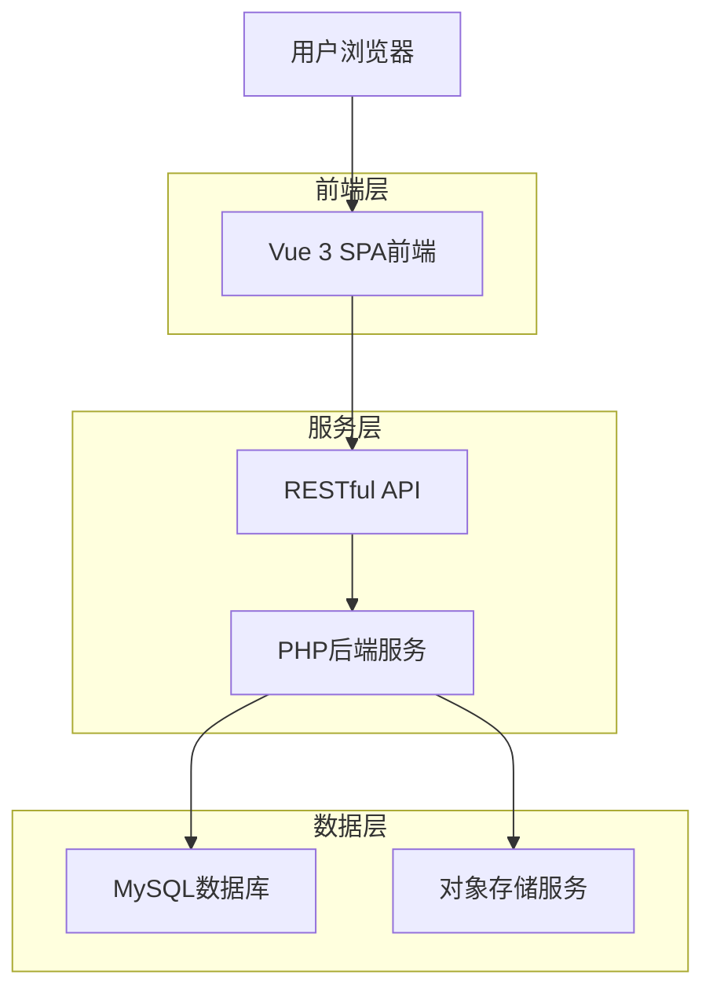
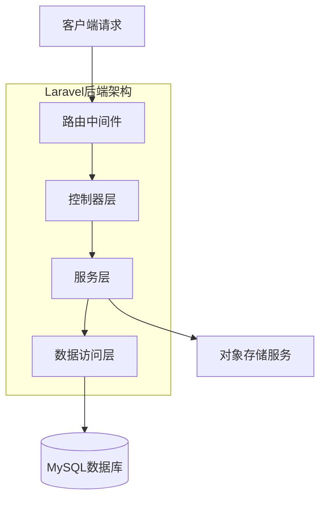
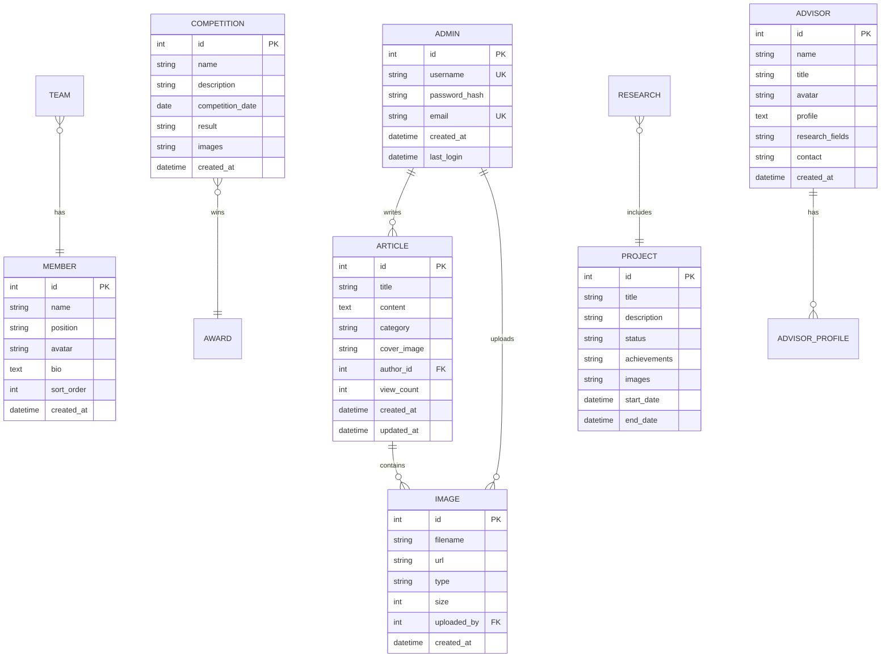

## 1. 架构设计



## 2. 技术描述

- **前端框架**: Vue 3 + Vite + Vue Router + Pinia
- **UI组件库**: Element Plus
- **Markdown编辑器**: @kangc/v-md-editor
- **HTTP客户端**: Axios
- **初始化工具**: vite-init
- **后端框架**: PHP 8.0 + Laravel 10
- **数据库**: MySQL 8.0
- **对象存储**: 阿里云OSS / 腾讯云COS
- **缓存**: Redis (可选)

## 3. 路由定义

| 路由路径 | 页面用途 |
|---------|---------|
| / | 首页，展示团队介绍和最新动态 |
| /team | 队伍风采页面，展示团队成员和文化 |
| /competitions | 比赛成果页面，展示参赛经历和获奖情况 |
| /research | 科研项目页面，展示研究成果和项目详情 |
| /advisors | 指导老师页面，展示导师信息和风采 |
| /article/:id | 文章详情页面，展示Markdown文章内容 |
| /admin/login | 后台管理登录页面 |
| /admin/dashboard | 后台管理首页 |
| /admin/content | 内容管理页面 |
| /admin/articles | 文章管理页面 |
| /admin/images | 图片管理页面 |
| /admin/settings | 系统配置页面 |

## 4. API定义

### 4.1 内容管理API

**获取首页内容**
```
GET /api/home/content
```

响应参数：
| 参数名 | 类型 | 描述 |
|--------|------|------|
| banner | array | 轮播图列表 |
| introduction | object | 团队介绍信息 |
| latest_news | array | 最新动态列表 |

**获取队伍风采**
```
GET /api/team/info
```

响应参数：
| 参数名 | 类型 | 描述 |
|--------|------|------|
| members | array | 团队成员列表 |
| culture | object | 团队文化信息 |
| history | array | 发展历程时间轴 |

### 4.2 时间轴管理API

**获取时间轴列表**
```
GET /api/timeline
```

响应参数：
| 参数名 | 类型 | 描述 |
|--------|------|------|
| id | number | 事件ID |
| year | number | 年份 |
| title | string | 事件标题 |
| description | string | 事件描述 |
| date | string | 具体日期 |

**创建时间轴事件**
```
POST /api/timeline
```

请求体：
| 参数名 | 类型 | 必需 | 描述 |
|--------|------|------|------|
| year | number | 是 | 年份 |
| title | string | 是 | 事件标题 |
| description | string | 是 | 事件描述 |
| date | date | 否 | 具体日期 |

### 4.3 文章管理API

**获取文章列表**
```
GET /api/articles
```

请求参数：
| 参数名 | 类型 | 必需 | 描述 |
|--------|------|------|------|
| page | number | 否 | 页码，默认1 |
| limit | number | 否 | 每页数量，默认10 |
| category | string | 否 | 文章分类 |

**创建文章**
```
POST /api/articles
```

请求体：
| 参数名 | 类型 | 必需 | 描述 |
|--------|------|------|------|
| title | string | 是 | 文章标题 |
| content | string | 是 | Markdown内容 |
| category | string | 是 | 文章分类 |
| cover_image | string | 否 | 封面图片URL |

### 4.3 图片上传API

**上传图片**
```
POST /api/upload/image
```

请求体：
| 参数名 | 类型 | 必需 | 描述 |
|--------|------|------|------|
| image | file | 是 | 图片文件 |
| type | string | 是 | 图片类型：avatar/banner/content |

响应参数：
| 参数名 | 类型 | 描述 |
|--------|------|------|
| url | string | 图片访问URL |
| filename | string | 文件名 |
| size | number | 文件大小 |

### 4.4 用户认证API

**管理员登录**
```
POST /api/admin/login
```

请求体：
```json
{
  "username": "admin",
  "password": "password123"
}
```

响应参数：
| 参数名 | 类型 | 描述 |
|--------|------|------|
| token | string | JWT令牌 |
| user_info | object | 用户信息 |

## 5. 服务器架构图



## 6. 数据模型

### 6.1 数据模型定义



### 6.2 数据定义语言

**管理员表 (admins)**
```sql
CREATE TABLE admins (
    id INT PRIMARY KEY AUTO_INCREMENT,
    username VARCHAR(50) UNIQUE NOT NULL,
    password_hash VARCHAR(255) NOT NULL,
    email VARCHAR(100) UNIQUE NOT NULL,
    created_at TIMESTAMP DEFAULT CURRENT_TIMESTAMP,
    last_login TIMESTAMP NULL,
    INDEX idx_username (username),
    INDEX idx_email (email)
);

-- 初始化管理员账号
INSERT INTO admins (username, password_hash, email) VALUES 
('admin', '$2y$10$92IXUNpkjO0rOQ5byMi.Ye4oKoEa3Ro9llC/.og/at2.uheWG/igi', 'admin@example.com');
```

**文章表 (articles)**
```sql
CREATE TABLE articles (
    id INT PRIMARY KEY AUTO_INCREMENT,
    title VARCHAR(200) NOT NULL,
    content TEXT NOT NULL,
    category VARCHAR(50) NOT NULL,
    cover_image VARCHAR(500),
    author_id INT NOT NULL,
    view_count INT DEFAULT 0,
    created_at TIMESTAMP DEFAULT CURRENT_TIMESTAMP,
    updated_at TIMESTAMP DEFAULT CURRENT_TIMESTAMP ON UPDATE CURRENT_TIMESTAMP,
    FOREIGN KEY (author_id) REFERENCES admins(id) ON DELETE CASCADE,
    INDEX idx_category (category),
    INDEX idx_created_at (created_at DESC),
    FULLTEXT idx_title_content (title, content)
);
```

**图片资源表 (images)**
```sql
CREATE TABLE images (
    id INT PRIMARY KEY AUTO_INCREMENT,
    filename VARCHAR(255) NOT NULL,
    url VARCHAR(500) NOT NULL,
    type ENUM('avatar', 'banner', 'content', 'competition', 'project') NOT NULL,
    size INT NOT NULL,
    uploaded_by INT NOT NULL,
    created_at TIMESTAMP DEFAULT CURRENT_TIMESTAMP,
    FOREIGN KEY (uploaded_by) REFERENCES admins(id) ON DELETE CASCADE,
    INDEX idx_type (type),
    INDEX idx_created_at (created_at DESC)
);
```

**团队成员表 (members)**
```sql
CREATE TABLE members (
    id INT PRIMARY KEY AUTO_INCREMENT,
    name VARCHAR(100) NOT NULL,
    position VARCHAR(100) NOT NULL,
    avatar VARCHAR(500),
    bio TEXT,
    sort_order INT DEFAULT 0,
    created_at TIMESTAMP DEFAULT CURRENT_TIMESTAMP,
    INDEX idx_sort_order (sort_order)
);
```

**比赛成果表 (competitions)**
```sql
CREATE TABLE competitions (
    id INT PRIMARY KEY AUTO_INCREMENT,
    name VARCHAR(200) NOT NULL,
    description TEXT,
    competition_date DATE,
    result VARCHAR(500),
    images JSON,
    created_at TIMESTAMP DEFAULT CURRENT_TIMESTAMP,
    INDEX idx_competition_date (competition_date DESC)
);
```

**科研项目表 (projects)**
```sql
CREATE TABLE projects (
    id INT PRIMARY KEY AUTO_INCREMENT,
    title VARCHAR(200) NOT NULL,
    description TEXT,
    status ENUM('ongoing', 'completed', 'planned') DEFAULT 'ongoing',
    achievements TEXT,
    images JSON,
    start_date DATE,
    end_date DATE,
    created_at TIMESTAMP DEFAULT CURRENT_TIMESTAMP,
    INDEX idx_status (status),
    INDEX idx_start_date (start_date DESC)
);
```

**指导老师表 (advisors)**
```sql
CREATE TABLE advisors (
    id INT PRIMARY KEY AUTO_INCREMENT,
    name VARCHAR(100) NOT NULL,
    title VARCHAR(100) NOT NULL,
    avatar VARCHAR(500),
    profile TEXT,
    research_fields VARCHAR(500),
    contact VARCHAR(200),
    created_at TIMESTAMP DEFAULT CURRENT_TIMESTAMP,
    INDEX idx_name (name)
);

**发展历程时间轴表 (timeline_events)**
```sql
CREATE TABLE timeline_events (
    id INT PRIMARY KEY AUTO_INCREMENT,
    year INT NOT NULL,
    title VARCHAR(200) NOT NULL,
    description TEXT,
    event_date DATE,
    created_at TIMESTAMP DEFAULT CURRENT_TIMESTAMP,
    INDEX idx_year (year DESC),
    INDEX idx_event_date (event_date DESC)
);
```

## 7. 部署配置

### 7.1 环境要求
- **Web服务器**: Nginx 1.20+ / Apache 2.4+
- **PHP版本**: PHP 8.0+
- **数据库**: MySQL 8.0+
- **Node.js**: 16.0+ (用于构建前端)

### 7.2 对象存储配置
需要在后端配置对象存储服务的访问密钥和存储桶信息：
- 阿里云OSS: AccessKeyId, AccessKeySecret, Bucket名称, Endpoint
- 腾讯云COS: SecretId, SecretKey, Bucket名称, Region

### 7.3 安全配置
- JWT密钥管理
- CORS跨域配置
- SQL注入防护
- XSS攻击防护
- 文件上传类型限制
- 管理员密码加密存储